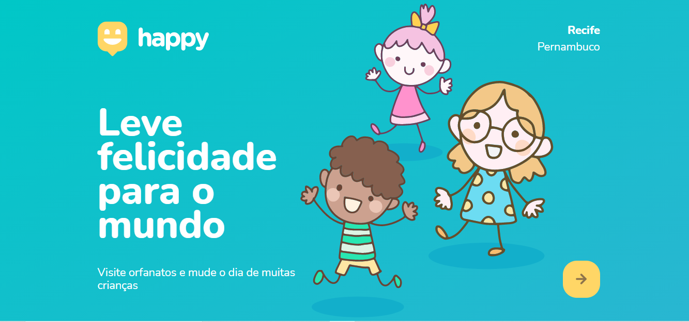
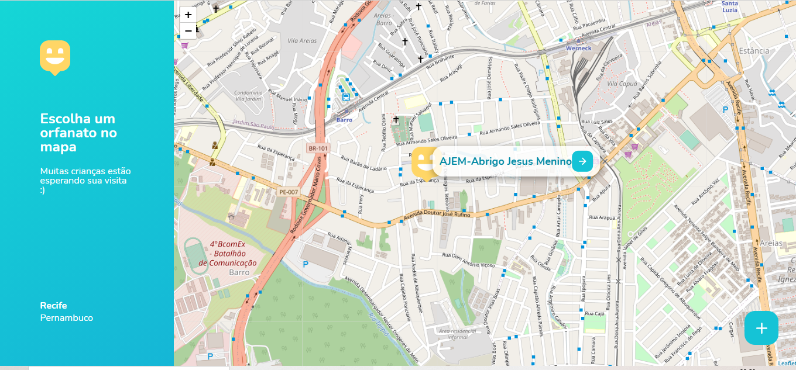
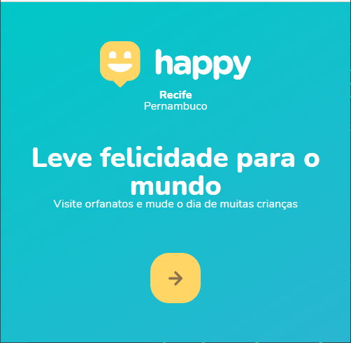

<h1 align="center">
    
</h1>

  <a href="#-tecnologias">Tecnologias</a>&nbsp;&nbsp;&nbsp;|&nbsp;&nbsp;&nbsp;
  <a href="#-projeto">Projeto</a>&nbsp;&nbsp;&nbsp;|&nbsp;&nbsp;&nbsp;
  <a href="#-layout">Layout</a>&nbsp;&nbsp;&nbsp;|&nbsp;&nbsp;&nbsp;
  <a href="#memo-licença">Licença</a>&nbsp;&nbsp;&nbsp;|&nbsp;&nbsp;&nbsp;
  <a href="#-Executar">Execução</a>

  

 

  

  

<h2 align=center>Responsividade no Smartphone :iphone: </h2>

  

  

## 🚀 Tecnologias

Esse projeto foi desenvolvido com as seguintes tecnologias:

- [Node.js](https://nodejs.org/en/)
- [Express](https://expressjs.com/pt-br/)
- [SQLite](https://www.sqlite.org/index.html)
- [Handlebars](https://handlebarsjs.com/)

## 💻 Projeto

O Happy é uma aplicação que têm o propósito de conectar as pessoas às casas de acolhimento de crianças e facilitar o acesso as informações de contato, endereço e horário de funcionamento 💜 Foi desenvolvida durante um evento de tempo limitado, a Semana Next Level Week #3, gratuita e online pela [Rocketseat](https://rocketseat.com.br/). Após a conclusão além do conhecimento foi possível sentir como é participar de uma comunidade gigantesca e ainda construir uma aplicação de valor social importante.

## 🔖 Layout

Você pode visualizar o layout do projeto através [desse link](https://www.figma.com/file/mDEbnoojksG4w8sOxmudh3/Happy-Web). Lembrando que você precisa ter uma conta no [Figma](http://figma.com/) para acessá-lo.

## :memo: Licença

Esse projeto está sob a licença MIT. Veja o arquivo [LICENSE](LICENSE.md) para mais detalhes.

--

##Executar
## Clonar o repositório na sua máquina.
### Abrir o repositório, dentro do seu editor favorito, executar no terminal
~~~javascript
npm install node
~~~
### Em seguida startar a aplicação no terminal
#### Siga para a pasta src/views e digite 
~~~ javascript
npm start
~~~~
##### Será aberto a aplicação, cole no URL do seu navegador - localhost:5500
## :pencil2: Autor
Lazaro Souza :runner:  
Entusiasta na arte de aprender algo do zero 
Cursando Superior de Tecnologia em Análise e Desenvolvimento de Sistemas :books: (2020-2022) 

https://www.linkedin.com/in/lazarok09
### Aprenda a usar o [markdown](https://docs.pipz.com/central-de-ajuda/learning-center/guia-basico-de-markdown#open) no seu GitHub
#### Use [emojis](https://github.com/ikatyang/emoji-cheat-sheet) no seu readme :P

< / :heart: >

